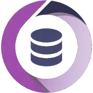

<h1 align="center">
  
  <div>Odoo GitHub Collector</div>
</h1>

<p align="center">
  Collects Odoo module metadata from GitHub/GitLab organizations, visualizes it on a web dashboard,
  and serves it to LLM clients over MCP.
</p>

<p align="center">
  <a href="https://github.com/Tardo/OGHCollector/actions/workflows/tests.yml"></a>
  <a href="./COPYING"></a>
</p>

---

## Overview

The project is a Rust workspace made of three services that share a single SQLite database:

| Service | Binary | Role |
| --- | --- | --- |
| **OGHCollector** | `oghcollector` | CLI that clones repositories, parses Odoo `__manifest__.py` files and writes the collected metadata to the database. |
| **OGHServer** | `oghserver` | actix-web dashboard that reads the database in read-only mode (module search, dependency graph, migration tracking, committer stats, etc). |
| **OGHMcp** | `oghmcp` | Read-only [MCP](https://modelcontextprotocol.io/) server exposing module, repository, dependency, code-analysis, and maintenance data as tools over a Streamable HTTP endpoint (`/mcp`), so any LLM client can reach it by URL. |

All three ship in the same Docker image and the project is designed to be run with Docker Compose.

---

## Requirements

1. [Docker](https://docs.docker.com/get-docker/) and the Docker Compose plugin.
2. A GitHub and/or GitLab personal access token so the collector can query the API:
   - [Creating a GitHub personal access token](https://docs.github.com/en/authentication/keeping-your-account-and-data-secure/managing-your-personal-access-tokens)
   - A personal access token for your GitLab instance, if you also collect from GitLab.

---

## Quick Start

```sh
git clone git@github.com:Tardo/OGHCollector.git
cd OGHCollector

# 1. Build the images
docker compose build

# 2. Populate the database at least once. The image entrypoint applies pending
#    Diesel migrations automatically; see "Database & Migrations" below.
docker compose run --rm -u appuser -T app oghcollector OCA 18.0

# 3. Start the dashboard (:8080) and the MCP endpoint (:8081)
docker compose up
```

The dashboard is now available at `http://localhost:8080` and the MCP endpoint at `http://localhost:8081/mcp`.

> `oghserver` and `oghmcp` open the database **read-only**. Their containers create the database
> and apply migrations before starting, but they will not serve collected module data until
> `oghcollector` has run at least once.

---

## Database & Migrations (Diesel)

The schema is managed with [Diesel](https://diesel.rs/); migration files live in [`migrations/`](./migrations).

### With Docker (the normal workflow)

The image entrypoint runs `oghmigrate` before every `oghserver`, `oghmcp`, or `oghcollector`
command. It creates the database file if needed and applies all pending migrations, so there is
nothing to run by hand. Run the collector to populate the schema with module data:

```sh
docker compose run --rm -u appuser -T app oghcollector OCA 18.0
```

### Local (non-Docker) development

If you're running the crates directly with `cargo run`, use the standalone migration runner:

```sh
cargo run -p sqlitedb --bin migrate -- data/data.db
```

> `crates/sqlitedb/src/schema.rs` is regenerated by Diesel, never hand-edited. `diesel.toml` sets
> `sqlite_integer_primary_key_is_bigint = true` and applies `crates/sqlitedb/schema.patch` to fix
> non-null primary keys and wider integer columns. Update the patch, not the generated schema.

See [`docs/development.md`](./docs/development.md) for the full non-Docker development setup.

---

## OGHServer

### Configuration

Mount a volume to `/app/server.yaml` (JSON is also supported) to override the defaults:

| Name | Type | Description | Default |
| --- | --- | --- | --- |
| `bind_address` | string | Address to bind the server on | `0.0.0.0` |
| `port` | int | Port to bind the server on | `8080` |
| `workers` | int | Number of worker processes | `2` |
| `template_autoreload` | bool | Reload templates automatically when they change | `false` |
| `allowed_origins` | list of strings | Allowed cross-origin CORS origins. Empty denies cross-origin browser access. | `[]` |
| `cookie_key` | string | Key used to sign session cookies; must be at least 64 bytes, otherwise a new key is generated at startup | |
| `upload_limit` | int | Maximum upload size, in bytes | `2097152` |
| `cache_ttl` | int | Seconds a cache entry stays valid | `3600` |
| `db_pool_max_size` | int | Maximum number of pooled DB connections | `15` |
| `doodba_max_modules` | int | Maximum number of modules accepted per Doodba tool request (converter/dependency-resolver/migration-plan); larger requests are rejected with `400` | `500` |
| `mcp_info_enabled` | bool | Show the `/mcp` page explaining how to connect popular LLM clients to the MCP endpoint, and its nav link | `false` |
| `scan_enabled` | bool | Enable the live instance scanner. Disabled by default because it creates outbound requests; enable it only behind the access controls appropriate for your deployment. | `false` |
| `mcp_url` | string | Public URL of the MCP endpoint, displayed on that page | `http://localhost:8081/mcp` |
| `trusted_proxies` | list of strings | IPs/CIDRs (e.g. your reverse proxy's address, or the Docker network subnet) allowed to set `X-Forwarded-For`/`Forwarded`; honored only when the request's direct TCP peer matches one of these, otherwise the headers are stripped and the real peer address is used instead. Needed for correct client IPs in access logs (and `REQ_BASE_URL` scheme/host) behind Traefik/nginx/etc. | `[]` |
| `seo_enabled` | bool | Allow search engines/social previews to index and share the site: `/robots.txt` returns `Allow: /` instead of `Disallow: /`, and pages get a canonical link plus Open Graph/Twitter Card meta tags. Off by default so nothing is shared/indexed until explicitly opted in. | `false` |
| `semantic_search_enabled` | bool | Enable embedding-based "Semantic" search (the `/v1/semantic-search` endpoint, the "Semantic" option in the search dropdowns, and its entry on the `/api` page). When off, the option is hidden, the route is not served and the embedding model is never downloaded or loaded in memory. On by default so the feature keeps working unless explicitly disabled. | `true` |

```yaml
# docker-compose.override.yaml
services:
  app:
    volumes:
      - ./server.yaml:/app/server.yaml
```

---

## OGHCollector

### Usage

```sh
docker compose run --rm -u appuser -T app oghcollector <origin> <version> [git_type]
```

- `<origin>`:
  - The name of an organization — all its repositories are scanned, up to 12,700 GitHub repositories or 25,400 GitLab projects.
  - The name of a repository, optionally followed by `:` and a comma-separated list of folders to scan. Each folder must start with `/` (it's appended directly to the clone path). To scan the repo root *as well as* subfolders, add a trailing comma (an empty entry means the root): `:/addons,` scans `/addons` plus the root.
- `<version>`: Odoo version to collect (e.g. `18.0`).
- `[git_type]`: Optional git client to use: `GH` (GitHub, default), `GL` (gitlab.com), or `GL:<api_url>` (a GitLab API URL).

> Repository mode currently clones GitHub URLs, so use organization mode for GitLab collections.

### Examples

```sh
# Odoo core modules, 18.0 (GitHub)
docker compose run --rm -u appuser -T app oghcollector odoo/odoo:/addons,/odoo/addons 18.0

# OCA/web modules, 18.0 (GitHub)
docker compose run --rm -u appuser -T app oghcollector OCA/web 18.0

# All OCA modules, 18.0 (GitHub)
docker compose run --rm -u appuser -T app oghcollector OCA 18.0

# All MyGroup modules, 18.0 (self-hosted GitLab)
docker compose run --rm -u appuser -T app oghcollector MyGroup 18.0 GL:https://mygitlabinstance.com/api/v4/
```

> If you run this behind Traefik, you may need to add `-l traefik.enable=false` so the one-off
> container isn't picked up as a routable service.

### Authentication

The recommended way to provide API tokens is through Docker secrets, so they never end up in
`docker-compose.yaml` or shell history. The collector automatically reads `/run/secrets/gh_token` and
`/run/secrets/gl_token` if present:

```yaml
# docker-compose.override.yaml
services:
  app:
    secrets:
      - gh_token
      - gl_token

secrets:
  gh_token:
    file: ./gh_token.txt
  gl_token:
    file: ./gl_token.txt
```

Secret contents are trimmed, so a trailing newline is fine. A nonempty secret takes precedence;
an absent or empty secret falls back to the corresponding environment variable.

Alternatively, without secrets, set `OGHCOLLECTOR_TOKEN_GH` / `OGHCOLLECTOR_TOKEN_GL` as environment
variables (used as a fallback when the corresponding secret file isn't found).

### Scheduling updates

To refresh the database periodically, add a cron job on the host that invokes [`update_db.sh`](./update_db.sh),
which loops over every supported Odoo/OpenERP version for `odoo/odoo` and `OCA`:

```cron
0 */6 * * * cd /path/to/OGHCollector && ./update_db.sh
```

---

## OGHMcp

Streamable HTTP MCP endpoint exposing module and repository discovery, module metadata, documentation,
dependencies, code analysis, version history, and committer activity over the same data as `oghserver`.

### Configuration

Mount a volume to `/app/mcp.yaml` (JSON is also supported) to override the defaults. Every key can also be
set via an `OGHCOLLECTOR_MCP_`-prefixed environment variable (e.g. `OGHCOLLECTOR_MCP_CACHE_TTL`), which
takes precedence over the file:

| Name | Type | Description | Default |
| --- | --- | --- | --- |
| `cache_ttl` | int | Seconds cached module and repository query results stay valid | `3600` |

```yaml
# docker-compose.override.yaml
services:
  mcp:
    volumes:
      - ./mcp.yaml:/app/mcp.yaml
```

By default the MCP server only accepts requests whose `Host` header is `localhost`, `127.0.0.1` or `::1`
(DNS-rebinding protection). For any real deployment, set `OGHCOLLECTOR_MCP_ALLOWED_HOSTS` to the
hostname(s)/IP(s) your clients actually connect to:

```yaml
# docker-compose.override.yaml
services:
  mcp:
    environment:
      OGHCOLLECTOR_MCP_ALLOWED_HOSTS: mcp.example.com,203.0.113.10
```

> `oghmcp` has no authentication of its own. If `oghserver` sits behind auth or a private network,
> give `oghmcp` the same treatment.
>
> `scan_instance` is disabled in MCP unless `OGHCOLLECTOR_SCAN_ENABLED=true`. Enable it only where
> access to the endpoint is controlled, as it makes outbound requests.

---

## Security and migration reports

- Static findings are review priorities, not confirmed vulnerabilities. Intentional broad-access
  naming (`public`, `all`, portal ACLs named after their group) still reduces noise; security-model
  privilege-escalation checks are independent. MCP `get_module_code_analysis` includes
  `security_warnings` and migration notes with source file/line where available.
- Migration notes are a checklist, not a target-version compatibility test. Apply version-specific
  advice only to the target mentioned in each note.
- Live scans return `findings`, endpoint evidence and `checks` (`passed: null` means inconclusive).
  The arbitrary numeric `score` has been removed from the JSON response and dashboard. HTTP 200
  alone does not establish sensitive-file or database exposure, and module names are not used to
  guess a running Odoo version.

After updating analysis rules, refresh existing snapshots by running the collector with
`OGHCOLLECTOR_FORCE_REANALYZE=1` (otherwise unchanged module sources are skipped):

```sh
OGHCOLLECTOR_FORCE_REANALYZE=1 cargo run --bin collector -- OCA 18.0
```

## Environment Variables

| Variable | Used by | Purpose |
| --- | --- | --- |
| `OGHCOLLECTOR_TOKEN_GH` | collector | GitHub API token (fallback if the `gh_token` Docker secret isn't set) |
| `OGHCOLLECTOR_TOKEN_GL` | collector | GitLab API token (fallback if the `gl_token` Docker secret isn't set) |
| `DATABASE_URL` | Diesel CLI | SQLite connection string (local, non-Docker development only) |
| `OGHCOLLECTOR_DB_PATH` | server, mcp, Docker migration entrypoint | Path to the SQLite database (default `data/data.db`); the MCP's first CLI argument takes precedence |
| `OGHCOLLECTOR_SCAN_ENABLED` | server, mcp | Enable live instance scans. Disabled by default. |
| `OGHCOLLECTOR_MCP_BIND_ADDR` | mcp | HTTP bind address (default `0.0.0.0:8081`) |
| `OGHCOLLECTOR_MCP_ALLOWED_HOSTS` | mcp | Comma-separated `Host` header allowlist (default `localhost,127.0.0.1,::1`) |
| `OGHCOLLECTOR_MCP_CACHE_TTL` | mcp | Overrides `cache_ttl` from `mcp.yaml` (default `3600`) |
| `OGHCOLLECTOR_EMBED_CACHE_DIR` | collector, server, mcp | Directory for the embedding model cache (default `data/.fastembed_cache`) |
| `OGHCOLLECTOR_FORCE_REANALYZE` | collector | Reanalyze module sources even when their latest commit has not changed |
| `RUST_LOG` | all three binaries | Log level (default: `info`) |

---

## Advanced Configuration

`docker-compose.yaml` is meant to stay untouched; layer your own settings (volumes, env vars, ports) on
top of it with a `docker-compose.override.yaml` file, which Docker Compose picks up automatically.

---

## Development

See [`docs/development.md`](./docs/development.md) for running the crates and the frontend build directly
with Cargo/pnpm, outside of Docker.

## License

Distributed under the terms of the [GNU AGPLv3](./COPYING).
